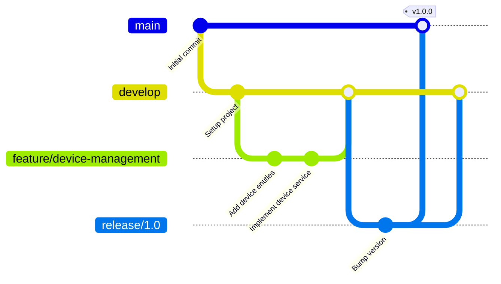

# Contributing to NexusHome IoT

Thank you for your interest in contributing to NexusHome IoT! This document provides guidelines and instructions for contributing to this project.

## Table of Contents

- [Code of Conduct](#code-of-conduct)
- [Getting Started](#getting-started)
- [Development Setup](#development-setup)
- [Project Structure](#project-structure)
- [Development Workflow](#development-workflow)
- [Coding Standards](#coding-standards)
- [Testing Guidelines](#testing-guidelines)
- [Pull Request Process](#pull-request-process)
- [Issue Guidelines](#issue-guidelines)
- [Community](#community)

## Code of Conduct

This project adheres to a Code of Conduct that all contributors are expected to follow. Please read [CODE_OF_CONDUCT.md](CODE_OF_CONDUCT.md) before contributing.

## Getting Started

### Prerequisites

- .NET 8 SDK or later
- Docker Desktop (for containerized services)
- SQL Server (local or Docker container)
- MQTT Broker (Mosquitto recommended)
- Git
- Your favorite IDE (Visual Studio 2022, VS Code with C# extension, or Rider)

### Quick Start

```bash
# Clone the repository
git clone https://github.com/aaron-seq/NexusHome_IoT.git
cd NexusHome_IoT

# Restore dependencies
dotnet restore

# Build the solution
dotnet build

# Run tests
dotnet test

# Run the application
dotnet run --project API/API.csproj
```

## Development Setup

### Using Docker Compose (Recommended)

```bash
# Start all services (SQL Server, MQTT, API, etc.)
docker-compose up -d

# View logs
docker-compose logs -f

# Stop services
docker-compose down
```

### Manual Setup

1. **SQL Server Setup**

```bash
# Using Docker
docker run -e "ACCEPT_EULA=Y" -e "SA_PASSWORD=YourStrong@Passw0rd" \
  -p 1433:1433 --name sqlserver \
  -d mcr.microsoft.com/mssql/server:2022-latest
```

2. **MQTT Broker Setup**

```bash
# Using Docker (Mosquitto)
docker run -it -p 1883:1883 -p 9001:9001 \
  --name mosquitto \
  eclipse-mosquitto
```

3. **Database Migration**

```bash
# Install EF Core tools if not already installed
dotnet tool install --global dotnet-ef

# Run migrations
dotnet ef database update --project Infrastructure
```

4. **Configuration**

Create `appsettings.Development.json` in the API project:

```json
{
  "ConnectionStrings": {
    "DefaultConnection": "Server=localhost;Database=NexusHomeDb;User Id=sa;Password=YourStrong@Passw0rd;TrustServerCertificate=True"
  },
  "MqttSettings": {
    "Broker": "localhost",
    "Port": 1883
  }
}
```

## Project Structure

The project follows Clean Architecture principles with clear separation of concerns:

```
NexusHome_IoT/
├── API/                          # Web API and SignalR hubs
│   ├── Controllers/              # API endpoints
│   ├── Hubs/                     # SignalR real-time hubs
│   └── Program.cs                # Application entry point
├── Application/                  # Business logic and use cases
│   ├── DTOs/                     # Data Transfer Objects
│   ├── Interfaces/               # Service contracts
│   └── Services/                 # Business logic implementation
├── Core/                         # Domain entities and business rules
│   ├── Entities/                 # Domain models
│   └── Interfaces/               # Repository contracts
├── Infrastructure/               # Data access and external services
│   ├── Data/                     # EF Core DbContext
│   ├── Repositories/             # Repository implementations
│   └── Services/                 # Infrastructure services (MQTT, etc.)
├── Models/                       # Shared models
├── DTOs/                         # Data Transfer Objects
├── Data/                         # Database contexts and migrations
├── Controllers/                  # Additional controllers
├── Energy/                       # Energy optimization services
├── AI/                          # Machine learning models
└── NexusHomeDeviceSimulator/    # IoT device simulator
```

## Development Workflow

### Branching Strategy

We follow Git Flow branching model:



**Branch Types:**

- `main` - Production-ready code, tagged with version numbers
- `develop` - Integration branch for features
- `feature/*` - New features (e.g., `feature/automation-rules`)
- `bugfix/*` - Bug fixes for develop branch
- `hotfix/*` - Urgent fixes for production
- `release/*` - Release preparation branches

### Conventional Commits

We follow the Conventional Commits specification:

```
<type>(<scope>): <subject>

<body>

<footer>
```

**Types:**
- `feat`: New feature
- `fix`: Bug fix
- `docs`: Documentation changes
- `style`: Code style changes (formatting, etc.)
- `refactor`: Code refactoring
- `perf`: Performance improvements
- `test`: Adding or updating tests
- `build`: Build system changes
- `ci`: CI/CD changes
- `chore`: Other changes that don't modify src or test files

**Examples:**

```bash
feat(mqtt): add support for QoS 2 messages
fix(api): resolve null reference in device controller
docs(readme): update installation instructions
refactor(data): migrate to EF Core 8
test(services): add unit tests for automation service
```

## Coding Standards

### C# Coding Conventions

Follow Microsoft's C# Coding Conventions and .NET best practices:

**Naming Conventions:**

```csharp
// Classes, interfaces, methods - PascalCase
public class DeviceService { }
public interface IDeviceRepository { }
public async Task<Device> GetDeviceAsync(int id) { }

// Private fields - camelCase with underscore prefix
private readonly ILogger<DeviceService> _logger;
private readonly IDeviceRepository _repository;

// Properties - PascalCase
public string DeviceName { get; set; }
public int DeviceId { get; set; }

// Parameters and local variables - camelCase
public void ProcessData(string deviceId, double temperature)
{
    var processedValue = temperature * 1.8 + 32;
}

// Constants - PascalCase
private const int MaxRetryAttempts = 3;
private const string DefaultDeviceType = "Sensor";
```

**Async/Await Patterns:**

```csharp
// Good - use async suffix, ConfigureAwait(false) in libraries
public async Task<Device> GetDeviceAsync(int id)
{
    return await _repository.GetByIdAsync(id).ConfigureAwait(false);
}

// Avoid - don't use async void except for event handlers
public async void ProcessDevice() // BAD
{
    // ...
}
```

**Dependency Injection:**

```csharp
// Constructor injection preferred
public class DeviceService : IDeviceService
{
    private readonly IDeviceRepository _repository;
    private readonly ILogger<DeviceService> _logger;
    private readonly IMqttService _mqttService;

    public DeviceService(
        IDeviceRepository repository,
        ILogger<DeviceService> logger,
        IMqttService mqttService)
    {
        _repository = repository ?? throw new ArgumentNullException(nameof(repository));
        _logger = logger ?? throw new ArgumentNullException(nameof(logger));
        _mqttService = mqttService ?? throw new ArgumentNullException(nameof(mqttService));
    }
}
```

### Entity Framework Core Best Practices:

```csharp
// Use async methods
public async Task<Device> GetDeviceByIdAsync(int id)
{
    return await _context.Devices
        .Include(d => d.Sensors)
        .FirstOrDefaultAsync(d => d.Id == id);
}

// Use AsNoTracking for read-only queries
public async Task<List<Device>> GetAllDevicesAsync()
{
    return await _context.Devices
        .AsNoTracking()
        .ToListAsync();
}

// Properly handle transactions
public async Task UpdateDeviceWithSensorsAsync(Device device)
{
    using var transaction = await _context.Database.BeginTransactionAsync();
    try
    {
        _context.Devices.Update(device);
        await _context.SaveChangesAsync();
        await transaction.CommitAsync();
    }
    catch
    {
        await transaction.RollbackAsync();
        throw;
    }
}
```

### IoT and MQTT Specific Guidelines:

```csharp
// Proper MQTT message handling
public async Task HandleDeviceMessageAsync(string topic, string payload)
{
    try
    {
        var message = JsonSerializer.Deserialize<DeviceMessage>(payload);
        
        // Validate message
        if (message == null || string.IsNullOrEmpty(message.DeviceId))
        {
            _logger.LogWarning("Invalid MQTT message received on topic {Topic}", topic);
            return;
        }
        
        // Process message
        await ProcessDeviceDataAsync(message);
    }
    catch (JsonException ex)
    {
        _logger.LogError(ex, "Failed to deserialize MQTT payload from topic {Topic}", topic);
    }
}
```

## Testing Guidelines

### Unit Tests

Write unit tests for all business logic:

```csharp
using Xunit;
using Moq;

public class DeviceServiceTests
{
    private readonly Mock<IDeviceRepository> _mockRepository;
    private readonly Mock<ILogger<DeviceService>> _mockLogger;
    private readonly DeviceService _service;

    public DeviceServiceTests()
    {
        _mockRepository = new Mock<IDeviceRepository>();
        _mockLogger = new Mock<ILogger<DeviceService>>();
        _service = new DeviceService(_mockRepository.Object, _mockLogger.Object);
    }

    [Fact]
    public async Task GetDeviceAsync_WithValidId_ReturnsDevice()
    {
        // Arrange
        var deviceId = 1;
        var expectedDevice = new Device { Id = deviceId, Name = "Test Device" };
        _mockRepository.Setup(r => r.GetByIdAsync(deviceId))
            .ReturnsAsync(expectedDevice);

        // Act
        var result = await _service.GetDeviceAsync(deviceId);

        // Assert
        Assert.NotNull(result);
        Assert.Equal(expectedDevice.Id, result.Id);
        Assert.Equal(expectedDevice.Name, result.Name);
    }

    [Fact]
    public async Task GetDeviceAsync_WithInvalidId_ReturnsNull()
    {
        // Arrange
        var deviceId = 999;
        _mockRepository.Setup(r => r.GetByIdAsync(deviceId))
            .ReturnsAsync((Device)null);

        // Act
        var result = await _service.GetDeviceAsync(deviceId);

        // Assert
        Assert.Null(result);
    }
}
```

### Integration Tests

```csharp
public class DeviceApiTests : IClassFixture<WebApplicationFactory<Program>>
{
    private readonly HttpClient _client;

    public DeviceApiTests(WebApplicationFactory<Program> factory)
    {
        _client = factory.CreateClient();
    }

    [Fact]
    public async Task GetDevices_ReturnsSuccessStatusCode()
    {
        // Act
        var response = await _client.GetAsync("/api/devices");

        // Assert
        response.EnsureSuccessStatusCode();
    }
}
```

### Test Coverage Goals

- Unit test coverage: 80%
- Integration test coverage for all API endpoints
- E2E tests for critical user flows

Run tests with coverage:

```bash
dotnet test /p:CollectCoverage=true /p:CoverletOutputFormat=opencover
```

## Pull Request Process

### Creating a Pull Request

1. **Fork and Clone**

```bash
# Fork the repository on GitHub, then clone your fork
git clone https://github.com/YOUR_USERNAME/NexusHome_IoT.git
cd NexusHome_IoT
git remote add upstream https://github.com/aaron-seq/NexusHome_IoT.git
```

2. **Create a Feature Branch**

```bash
git checkout -b feature/your-feature-name
```

3. **Make Your Changes**

- Write clean, tested code
- Follow coding standards
- Update documentation as needed
- Add tests for new features

4. **Commit Your Changes**

```bash
git add .
git commit -m "feat(scope): description of changes"
```

5. **Push and Create PR**

```bash
git push origin feature/your-feature-name
```

Then create a pull request on GitHub.

### PR Checklist

Before submitting, ensure:

- [ ] Code follows project coding standards
- [ ] All tests pass (`dotnet test`)
- [ ] New tests added for new features
- [ ] Documentation updated (if applicable)
- [ ] Commit messages follow conventional commits
- [ ] PR description clearly explains changes
- [ ] No merge conflicts with main branch
- [ ] Code has been self-reviewed
- [ ] Screenshots added for UI changes

### PR Review Process

1. **Automated Checks**: CI/CD pipeline runs tests and linters
2. **Code Review**: At least one maintainer reviews the code
3. **Feedback**: Address review comments and push updates
4. **Approval**: Once approved, PR will be merged

### PR Template

```markdown
## Description

Brief description of changes

## Type of Change

- [ ] Bug fix
- [ ] New feature
- [ ] Breaking change
- [ ] Documentation update

## Testing

Describe testing done

## Screenshots (if applicable)

## Checklist

- [ ] Tests pass locally
- [ ] Code follows style guidelines
- [ ] Documentation updated
```

## Issue Guidelines

### Reporting Bugs

When reporting bugs, include:

1. **Clear Title**: Describe the issue concisely
2. **Environment**: .NET version, OS, relevant dependencies
3. **Steps to Reproduce**: Detailed steps to reproduce the issue
4. **Expected Behavior**: What should happen
5. **Actual Behavior**: What actually happens
6. **Logs/Screenshots**: Any relevant error messages or screenshots

### Feature Requests

For feature requests:

1. **Use Case**: Describe the problem you're trying to solve
2. **Proposed Solution**: Your suggested implementation
3. **Alternatives**: Other solutions you've considered
4. **Additional Context**: Any other relevant information

### Issue Labels

- `bug`: Something isn't working
- `enhancement`: New feature or request
- `documentation`: Documentation improvements
- `good first issue`: Good for newcomers
- `help wanted`: Extra attention needed
- `question`: Further information requested
- `wontfix`: This will not be worked on
- `duplicate`: This issue already exists
- `invalid`: This doesn't seem right
- `security`: Security-related issue
- `iot`: IoT device specific
- `mqtt`: MQTT related
- `performance`: Performance improvements

## Community

### Getting Help

- **Discussions**: Use GitHub Discussions for questions and community support
- **Issues**: Report bugs and request features via GitHub Issues
- **Documentation**: Check the project wiki and README

### Contributing Beyond Code

You can contribute by:

- Improving documentation
- Writing tutorials or blog posts
- Creating example projects
- Answering questions in discussions
- Reviewing pull requests
- Testing new features
- Reporting bugs

### Recognition

Contributors are recognized in:

- README.md contributors section
- Release notes for significant contributions
- GitHub insights and contributions graph

## Release Process

### Versioning

We follow Semantic Versioning (SemVer):

- **MAJOR**: Breaking changes
- **MINOR**: New features (backward compatible)
- **PATCH**: Bug fixes (backward compatible)

### Release Checklist

1. Update version in project files
2. Update CHANGELOG.md
3. Create release branch
4. Run full test suite
5. Create GitHub release with notes
6. Merge to main and tag
7. Deploy to production

## License

By contributing, you agree that your contributions will be licensed under the project's MIT License.

## Questions?

If you have questions, please open a discussion on GitHub or reach out to the maintainers.

Thank you for contributing to NexusHome IoT!
